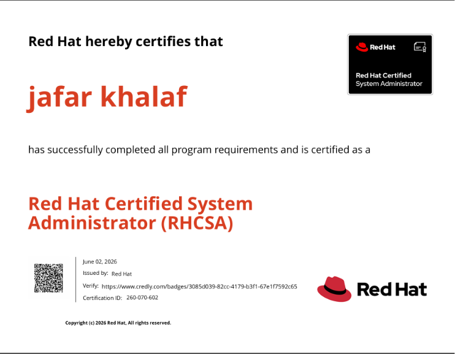
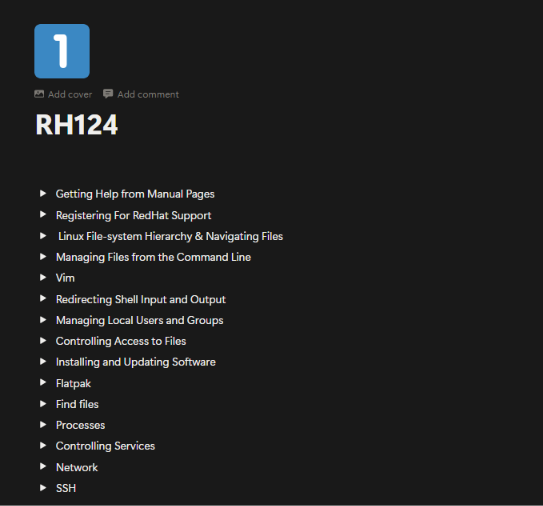
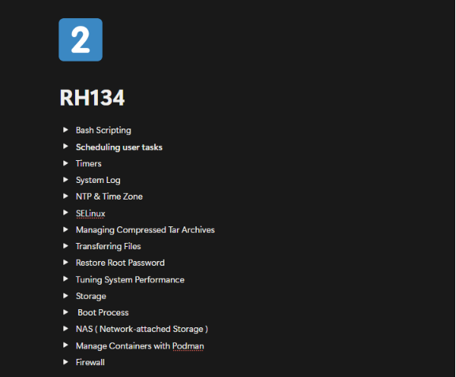
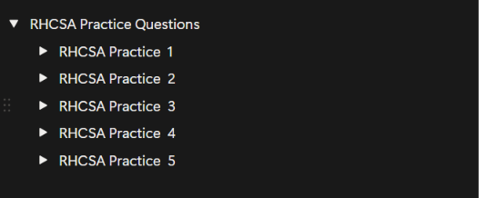

# 🎓 RHCSA (RHEL 10) Study Notes & Practice Repository 🐧🔴

  

## 🚀 About This Repository

Welcome to my **RHCSA (Red Hat Certified System Administrator) for RHEL 10** study repository! 🔴🐧

This repository contains my personal notes, study materials, practical exercises, and practice questions that I created while preparing for the **Red Hat Enterprise Linux 10 RHCSA Exam**.

Whether you're preparing for the certification, reviewing Linux administration concepts, or looking for hands-on practice, I hope these resources help you on your journey. 💡

---

# 📚 Course Notes

## RH124 - Red Hat System Administration I

  

The **RH124** section covers the fundamentals of Linux administration, including:

* 🐧 Linux basics and command-line usage
* 📂 File and directory management
* 👥 User and group administration
* 🔐 Permissions and access control
* 📦 Software management
* 🌐 Basic networking concepts
* ⚙️ Process management

---

## RH134 - Red Hat System Administration II

  

The **RH134** section focuses on more advanced system administration topics, including:

* 💾 Storage management and LVM
* 🚀 Boot process and system services
* 🔥 SELinux administration
* 🌐 Advanced networking
* 📁 NFS and file sharing
* ⏰ Scheduled tasks
* 🛠️ System troubleshooting
* 📊 System monitoring and performance tuning

---

# 🧪 Practice Questions

This repository also contains practice questions and lab exercises to help reinforce RHCSA objectives.

> ⚠️ **Important Note**
>
> These are **NOT actual RHCSA exam questions** and are not affiliated with Red Hat in any way.
>
> The questions and exercises are created solely for **study, review, and hands-on practice purposes** to help learners prepare for the certification exam.

  

---

# 📝 Complete Notes (Notion)

📖 Access the full study notes and organized learning materials here:

👉 **RHCSA Notion Workspace**
https://powerful-tiglon-788.notion.site/RHCSA-354a6c4a03758069a6d1f5ac78de92b1

---

# 🎯 Goals

✅ Master RHEL 10 Administration

✅ Prepare for RHCSA Certification

✅ Build Strong Linux Fundamentals

✅ Gain Real-World System Administration Skills

✅ Share Knowledge with the Community

---

# 🤝 Connect With Me

### 💼 LinkedIn

🔗 [www.linkedin.com/in/jafarkhalaf](http://www.linkedin.com/in/jafarkhalaf)

---

🔴 Red Hat   •   🐧 Linux   •   🎓 RHCSA   •   🚀 Open Source

---

⭐ If you find this repository useful, consider giving it a **Star** and sharing it with other Linux learners!

Happy Learning! 🐧🚀🔥
